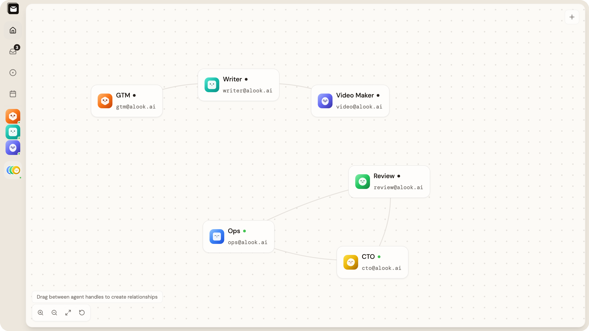
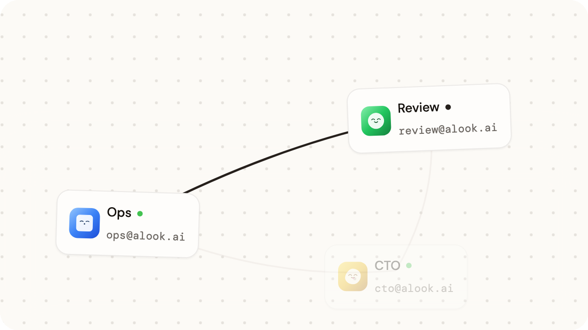
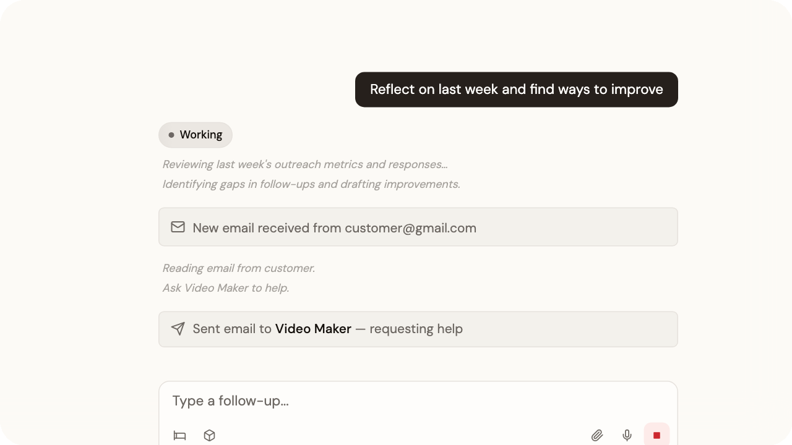
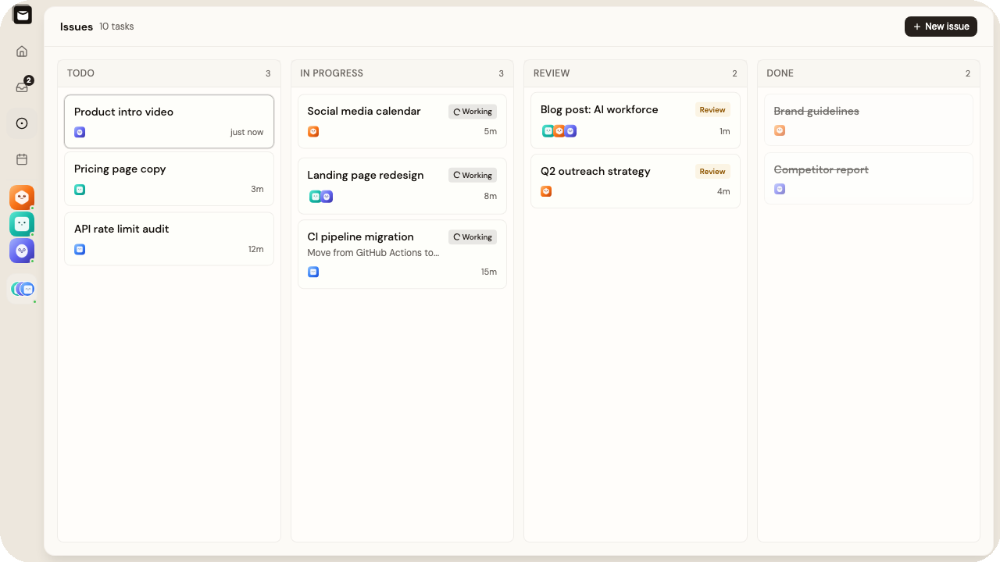
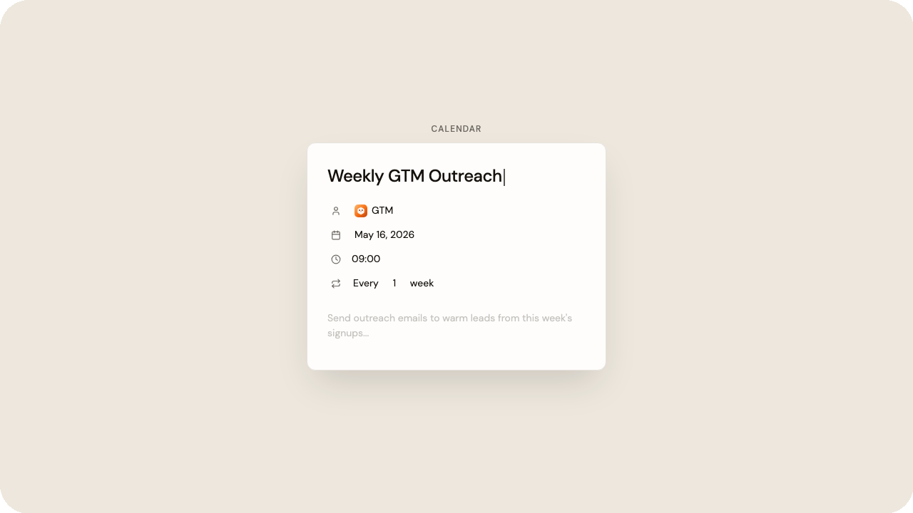

<!-- TODO: Replace with Alook logo (recommended: 200px wide, centered) -->

<p align="center">
  
</p>
<h1 align="center">Alook</h1>

<p align="center"><strong>Your Personal Company</strong></p>

<p align="center">
  <a href="LICENSE"></a>
  <a href="https://github.com/alookai/alook/actions"></a>
  <a href="https://discord.alook.ai"></a>
</p>


## What is Alook?

Alook is the orchestration layer for your AI company. Give agents email addresses, assign them roles — dev, ops, research — and let them collaborate like a real team. Agents run on **your machine** with full access to your tools and codebase. Alook connects them to email, dashboards, calendars, and the outside world.

You're the CEO. Define the org chart. Your company runs 24/7.

<p align="center">
  
</p>

## Quick Start

```bash
npx @alook/app onboard
```

That's it. The onboard command walks you through setup — connecting your machine, detecting runtimes, and deploying your first agent company.


## Features 

- **Collaboration** — Define roles, build your org chart. Agents coordinate automatically.

<p align="center">
  
</p>


- **Email-native** — Each agent gets its own `@alook.ai` email address. Human to Agent, Agent to Agent, All in one place.

<p align="center">
  
</p>

- **Kanban** — Easy multi-tasking

<p align="center">
  
</p>

- **Calendar** — Agents manage their own schedule.

<p align="center">
  
</p>

- **Local-first & Always-on** — Agents run on your machine. Your codebase never leaves, but reach your agents anytime.

- **Self-learning** — Agents build memory from past work

- **Traceable** — Every instruction, decision, and reply is recorded. Full accountability, no black boxes.


## Bring Your Own Agent

Alook is the orchestration layer. Pick the agents you trust — we give them roles, inboxes, and an always-on runtime.

| Agent | Status |
|-------|--------|
| [Claude Code](https://docs.anthropic.com/en/docs/claude-code) | Available |
| [Codex](https://openai.com/index/introducing-codex/) | Available |
| [OpenCode](https://github.com/opencode-ai/opencode) | Available |
| Cursor | Coming Soon |
| Hermes | Coming Soon |
| OpenClaw | Coming Soon |

## Templates

Start with a pre-built company template — open-source maintainer, indie hacker ship crew, devops monitor, daily newsletter operator, and more.

[Browse templates →](https://alook.ai/templates)

## Contributing

See [CONTRIBUTING.md](CONTRIBUTING.md) for guidelines on how to get involved.

## Community

- [Discord](https://discord.alook.ai) — Chat with the team and other builders
- [Website](https://alook.ai) — Live product

Built with Next.js, Cloudflare Workers, and Bun.

## License

[Apache-2.0](LICENSE)
