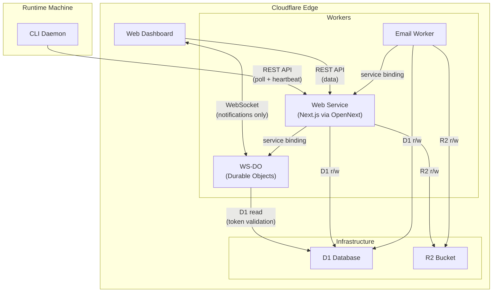

# 00 — Architecture Overview

> Unified platform spec: combining main's features with spec-plans' Cloudflare edge architecture into the full Alook platform.
> Sources: `origin/main` + `origin/chore/spec-plans` as of 2026-04-10.

---

## Goal

Build the unified Alook platform on Cloudflare's edge stack by combining main's mature backend (Web Service, CLI daemon, shared library) with spec-plans' edge-native services (Email Worker, WS-DO). The target is 5 services on Cloudflare Workers / D1 / R2 / Durable Objects.

---

## Service Map



## Services

| # | Service | Status on `main` | Source for Target | Doc |
|---|---------|-------------------|-------------------|-----|
| 1 | **Web Service** | Exists (Node.js + Postgres) | Migrate to Cloudflare Workers + D1 | [01-web-service.md](01-web-service.md) |
| 2 | **Email Worker** | Not on main | Full implementation preserved from `chore/spec-plans` | [02-email-worker.md](02-email-worker.md) |
| 3 | **WS-DO** | Not on main | Notification-only WebSocket for browser (simplified from spec-plans) | [03-ws-do.md](03-ws-do.md) |
| 4 | **CLI Daemon** | Exists (Node.js / Commander.js) | Follows main branch | [04-cli-daemon.md](04-cli-daemon.md) |
| 5 | **Shared Library** | Exists | No runtime change | [05-shared-library.md](05-shared-library.md) |

> **Migration execution order:** See [06-migration-order.md](06-migration-order.md) for the phased dependency graph and step-by-step sequence.

## Tech Stack — Main vs Target

| Layer | `main` (current) | Target (Cloudflare edge) |
|-------|-------------------|--------------------------|
| Web runtime | Node.js (Next.js standalone) | Cloudflare Workers (OpenNext) |
| Database | PostgreSQL 17 + Drizzle ORM | Cloudflare D1 (SQLite) |
| File storage | None | Cloudflare R2 |
| Real-time | HTTP polling only | WebSocket notifications via Durable Objects (browser re-fetches data via REST API) |
| Email inbound | Not implemented | Cloudflare Email Routing + Worker |
| Auth | Custom JWT + OTP (jose) | Better Auth (managed) |
| CLI runtime | Node.js (tsx/tsup) | Node.js (Bun) — follows main |
| CLI framework | Commander.js | Commander.js |
| Build system | Makefile | Turborepo |
| Dev environment | docker-compose (PostgreSQL) | Wrangler local dev (D1/R2) |

## Monorepo Structure

```
alook/
├── src/
│   ├── web/           # [1] Web Service — Next.js app + API routes
│   │   ├── app/       #     Pages + API route handlers
│   │   ├── lib/       #     DB, auth, middleware, services, queries
│   │   ├── components/#     React components
│   │   └── contexts/  #     React context providers
│   ├── cli/           # [4] CLI Daemon — commands + daemon + agent backends
│   │   ├── commands/  #     CLI commands (register, agent, daemon, etc.)
│   │   ├── daemon/    #     Daemon loop, client, agent backends
│   │   └── lib/       #     Config, logger, HTTP client
│   └── shared/        # [5] Shared Library — types, schemas, constants
├── package.json       # Root workspace config
└── pnpm-workspace.yaml
```

Services **not yet on main** (to be created):

```
src/
├── email-worker/      # [2] Email Worker — Cloudflare Worker
│   └── src/index.ts
└── ws-do/             # [3] WS-DO — Durable Objects for WebSocket
    └── src/
        ├── index.ts
        └── ws-durable.ts
```

## Key Workflows on Main

### User Login
1. Email + OTP: `POST /api/auth/send-code` -> `POST /api/auth/verify-code`
2. JWT issued (HS256, 72h) + cookie set
3. Frontend stores token in localStorage

### Machine Registration
1. Dashboard: `POST /api/machine-tokens` -> raw `al_*` token
2. CLI: `alook register --token al_...` -> validates via `GET /api/me`
3. CLI: `alook daemon start` -> `POST /api/daemon/register` with detected runtimes
4. Daemon loop: heartbeat (15s) + task poll (3s)

### Chat / Task Execution
1. User sends message -> `POST /api/conversations/{id}/messages`
2. Server creates message + enqueues task (status: `queued`)
3. Daemon claims task via `POST /api/daemon/runtimes/{id}/tasks/claim` -> `dispatched`
4. Daemon starts task -> `running`, spawns agent CLI
5. Agent streams task messages (batched: 20 msgs / 2s flush)
6. Agent completes -> `completed`, assistant message created
7. Frontend receives `{ type: "task.updated", id }` via WebSocket → re-fetches `GET /api/tasks/{id}`

### Stale Detection
- Heartbeat endpoint marks runtimes with no heartbeat > 45s as offline
- `failStaleDispatchedTasks()` fails tasks stuck in dispatched > 20s

## What Needs to Change for Edge Deployment

| Area | Migration Work |
|------|---------------|
| **Database** | PostgreSQL -> D1 (SQLite). Adapt Drizzle ORM to use `drizzle-orm/d1` adapter (Drizzle supports D1 natively). |
| **Auth** | Custom JWT -> Better Auth. Add OAuth providers (GitHub, Google). Session-based instead of stateless JWT. |
| **Real-time** | HTTP polling -> notification-only WebSocket via Durable Objects (browser-only). WS sends `{ type, id }` events, browser re-fetches data via REST API. See [03-ws-do.md](03-ws-do.md). |
| **Email** | Port spec-plans Email Worker implementation (see [02-email-worker.md](02-email-worker.md)). Email Worker verifies agent + whitelist via D1 (read-only), stores raw email in R2, then calls `POST /api/email/notify` on Web Service which creates email records and tasks. No events table. Add `email_handle` column to agent, add `agent_whitelist` and `emails` tables. |
| **Frontend** | Add mail inbox, whitelist management, WebSocket-driven updates. Replace polling with WS-DO push. |
| **CLI** | Follows main branch. Node.js + Commander.js. Dev runs via `pnpm cli` from project root. `.alook/` config at project root in dev. |
| **Infra** | Makefile -> Turborepo. docker-compose -> wrangler.toml per service. |
