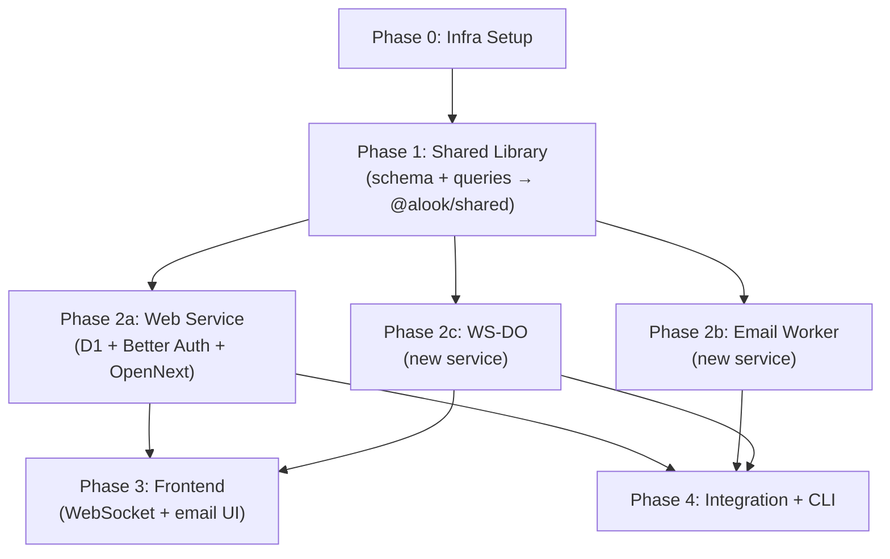

# 06 — Migration Order

> Step-by-step execution sequence for the Cloudflare edge migration.
> Dependencies between steps are explicit — work within a phase can be parallelized.

---

## Dependency Graph



---

## Phase 0 — Infrastructure Setup

**Goal:** Set up the Cloudflare project, monorepo tooling, and development environment.

| Step | Description | Doc |
|------|-------------|-----|
| 0.1 | Create Cloudflare D1 database (`alook-app`) | — |
| 0.2 | Create Cloudflare R2 bucket (`alook-emails`) | — |
| 0.3 | Replace Makefile with Turborepo (`turbo.json`) | [00-overview.md](00-overview.md) |
| 0.4 | Set up `pnpm-workspace.yaml` for all 5 packages | [00-overview.md](00-overview.md) |
| 0.5 | Create `wrangler.toml` for each Cloudflare service (web, email-worker, ws-do) | [01](01-web-service.md), [02](02-email-worker.md), [03](03-ws-do.md) |
| 0.6 | Set up local dev with `wrangler dev` replacing `docker-compose` | — |

**Exit criteria:** `pnpm install` succeeds, `wrangler dev` starts with D1/R2 bindings available locally.

---

## Phase 1 — Shared Library (`@alook/shared`)

**Goal:** Move schema, DB factory, and query modules from `src/web/lib/db/` into `src/shared/db/`. This is the foundation — all other phases depend on it.

| Step | Description | Doc |
|------|-------------|-----|
| 1.1 | Add `drizzle-orm` dependency to `@alook/shared` package.json | [05-shared-library.md](05-shared-library.md) |
| 1.2 | Create `src/shared/db/schema.ts` — convert all `pgTable` to `sqliteTable` (D1-compatible types) | [05-shared-library.md](05-shared-library.md) |
| 1.3 | Create `src/shared/db/index.ts` — `createDb(d1Binding)` factory using `drizzle-orm/d1` | [05-shared-library.md](05-shared-library.md) |
| 1.4 | Move query modules from `src/web/lib/db/queries/*.ts` to `src/shared/db/queries/*.ts` | [05-shared-library.md](05-shared-library.md) |
| 1.5 | Adapt queries for D1/SQLite (nanoid PKs, text dates, integer booleans, CAS task claiming) | [01-web-service.md](01-web-service.md) |
| 1.6 | Add `utils/email.ts` (`parseEmailHandle`) and `utils/validation.ts` (`isValidToken`) | [05-shared-library.md](05-shared-library.md) |
| 1.7 | Update `src/shared/index.ts` to re-export db, queries, schema, utils | [05-shared-library.md](05-shared-library.md) |
| 1.8 | Update Web Service to import from `@alook/shared` instead of local `lib/db/` | [01-web-service.md](01-web-service.md) |

**Exit criteria:** `@alook/shared` exports `createDb`, `schema`, `queries`, all types/schemas. Web Service compiles against shared imports.

---

## Phase 2a — Web Service (D1 + Better Auth + OpenNext)

**Goal:** Migrate the Web Service from Node.js/PostgreSQL to Cloudflare Workers/D1. Can start once Phase 1 is complete.

| Step | Description | Doc |
|------|-------------|-----|
| 2a.1 | Remove `postgres`, `jose`, `input-otp` dependencies. Add `better-auth`, `@opennextjs/cloudflare`. | [01-web-service.md](01-web-service.md) |
| 2a.2 | Configure `drizzle-kit` to point to `@alook/shared` schema. Generate D1 migration. | [01-web-service.md](01-web-service.md) |
| 2a.3 | Implement Better Auth setup (`lib/auth.ts`, `lib/auth-client.ts`) | [01-web-service.md](01-web-service.md) |
| 2a.4 | Implement dual-auth middleware (`lib/dual-auth.ts`) — machine tokens + Better Auth sessions | [01-web-service.md](01-web-service.md) |
| 2a.5 | Replace `/api/auth/send-code` and `/api/auth/verify-code` with Better Auth catch-all `[...all]` route | [01-web-service.md](01-web-service.md) |
| 2a.6 | Replace `/sign-in` and `/sign-up` pages with Better Auth forms (email/password + OAuth) | [01-web-service.md](01-web-service.md) |
| 2a.7 | Add `POST /api/email/notify` endpoint (receives from Email Worker, creates email record + task) | [02-email-worker.md](02-email-worker.md) |
| 2a.8 | Add WS-DO service binding + `notify()` helper for broadcasting events | [03-ws-do.md](03-ws-do.md) |
| 2a.9 | Add `GET /api/ws/token` endpoint for browser WebSocket auth | [03-ws-do.md](03-ws-do.md) |
| 2a.10 | Adapt all API route tests for D1 (replace PostgreSQL mocks) | [01-web-service.md](01-web-service.md) |
| 2a.11 | Configure OpenNext for Cloudflare Workers deployment | [01-web-service.md](01-web-service.md) |

**Exit criteria:** Web Service runs on `wrangler dev` with D1, Better Auth login works, all API routes pass tests.

---

## Phase 2b — Email Worker (new service)

**Goal:** Build the Email Worker. Can start once Phase 1 is complete. Does not depend on Phase 2a.

| Step | Description | Doc |
|------|-------------|-----|
| 2b.1 | Create `src/email-worker/` directory structure + `wrangler.toml` | [02-email-worker.md](02-email-worker.md) |
| 2b.2 | Implement `email()` handler — parse handle, verify agent, check whitelist, store R2, notify Web Service | [02-email-worker.md](02-email-worker.md) |
| 2b.3 | Implement `fetch()` handler — `/simulate` dev endpoint | [02-email-worker.md](02-email-worker.md) |
| 2b.4 | Write tests (agent resolution, R2 storage, whitelisted/non-whitelisted paths, error propagation) | [02-email-worker.md](02-email-worker.md) |

**Exit criteria:** Email Worker compiles, tests pass, `/simulate` endpoint works in local dev.

> **Note:** End-to-end testing with the Web Service requires Phase 2a.7 (`POST /api/email/notify` endpoint) to be complete.

---

## Phase 2c — WS-DO (new service)

**Goal:** Build the WebSocket Durable Objects service. Can start once Phase 1 is complete. Does not depend on Phase 2a.

| Step | Description | Doc |
|------|-------------|-----|
| 2c.1 | Create `src/ws-do/` directory structure + `wrangler.toml` | [03-ws-do.md](03-ws-do.md) |
| 2c.2 | Implement Worker entry point (`src/index.ts`) — broadcast + WebSocket upgrade routes | [03-ws-do.md](03-ws-do.md) |
| 2c.3 | Implement Durable Object (`src/ws-durable.ts`) — connection state, auth, broadcast | [03-ws-do.md](03-ws-do.md) |
| 2c.4 | Implement token validation via `@alook/shared` session queries | [03-ws-do.md](03-ws-do.md) |
| 2c.5 | Write tests (upgrade, auth, broadcast, rejection, cleanup) | [03-ws-do.md](03-ws-do.md) |

**Exit criteria:** WS-DO compiles, tests pass, WebSocket upgrade works in local dev.

> **Note:** End-to-end testing with the Web Service requires Phase 2a.8 (service binding + `notify()` helper).

---

## Phase 3 — Frontend (WebSocket + Email UI)

**Goal:** Update the browser frontend to use WebSocket notifications and add email management UI. Depends on Phase 2a (Web Service) and Phase 2c (WS-DO).

| Step | Description | Doc |
|------|-------------|-----|
| 3.1 | Add WebSocket client hook — connect to WS-DO, handle auth, receive notifications | [03-ws-do.md](03-ws-do.md) |
| 3.2 | Replace polling with WS-DO push for task messages, runtime status | [03-ws-do.md](03-ws-do.md) |
| 3.3 | Add email inbox page (list emails per agent) | [00-overview.md](00-overview.md) |
| 3.4 | Add whitelist management UI (add/remove sender emails per agent) | [00-overview.md](00-overview.md) |
| 3.5 | Update `AgentEditForm` with `email_handle` and `forward_to_email` fields | [01-web-service.md](01-web-service.md) |

**Exit criteria:** Browser receives real-time notifications via WebSocket, email management works end-to-end.

---

## Phase 4 — Integration & CLI

**Goal:** End-to-end integration testing and CLI compatibility verification. Depends on all Phase 2 work.

| Step | Description | Doc |
|------|-------------|-----|
| 4.1 | Verify CLI daemon works with new auth (machine tokens unchanged) | [04-cli-daemon.md](04-cli-daemon.md) |
| 4.2 | End-to-end: email → Email Worker → Web Service → task → CLI daemon → complete | [02-email-worker.md](02-email-worker.md) |
| 4.3 | End-to-end: send message → task → daemon claims → complete → WS-DO notification → browser refresh | [03-ws-do.md](03-ws-do.md) |
| 4.4 | Verify stale detection (runtime heartbeat + task timeout) works on D1 | [01-web-service.md](01-web-service.md) |
| 4.5 | Deploy all services to Cloudflare (wrangler deploy per service) | — |

**Exit criteria:** All services deployed, all end-to-end flows work in production.

---

## Parallelism Summary

```
Phase 0 ─────────────────── (sequential)
          │
Phase 1 ─────────────────── (sequential, foundation)
          │
          ├── Phase 2a ───── (Web Service)
          ├── Phase 2b ───── (Email Worker)    ← can run in parallel
          └── Phase 2c ───── (WS-DO)
                    │
Phase 3 ─────────────────── (depends on 2a + 2c)
Phase 4 ─────────────────── (depends on all Phase 2)
```

Phases 2a, 2b, and 2c are independent and can be developed in parallel once the shared library (Phase 1) is complete.
